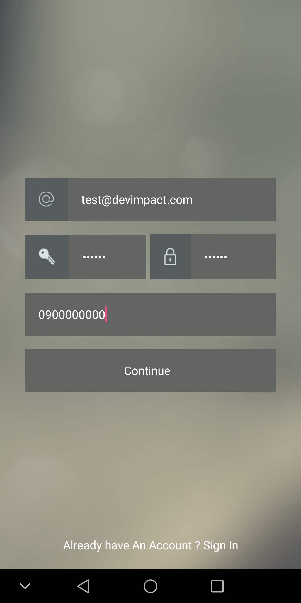
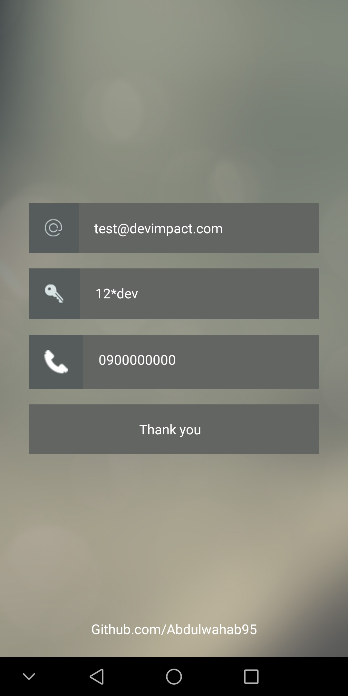
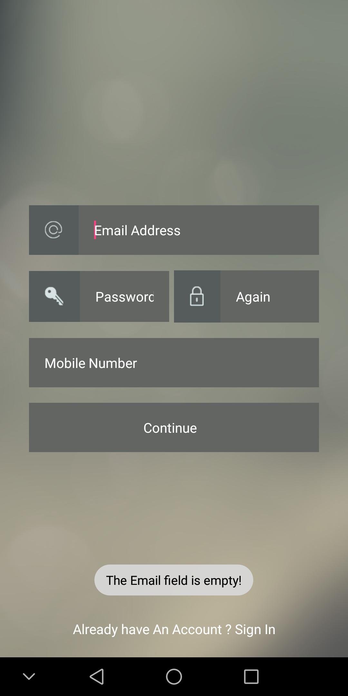
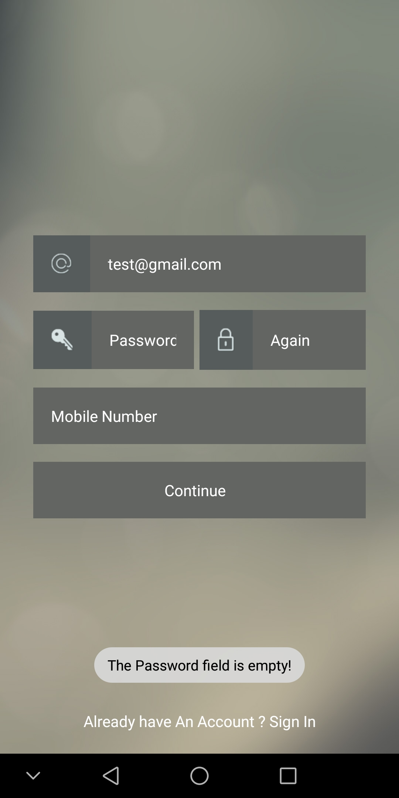
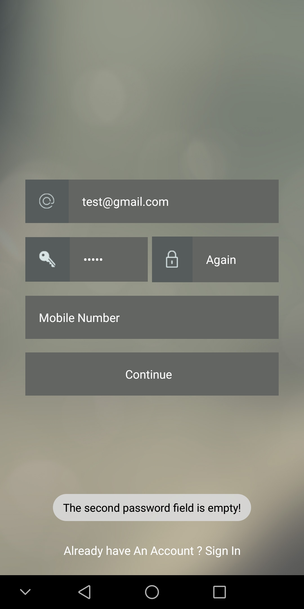
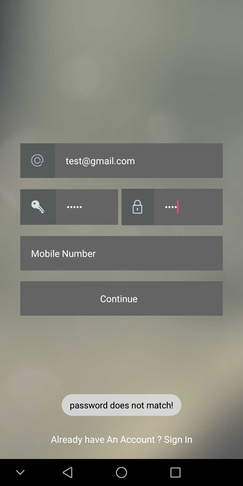
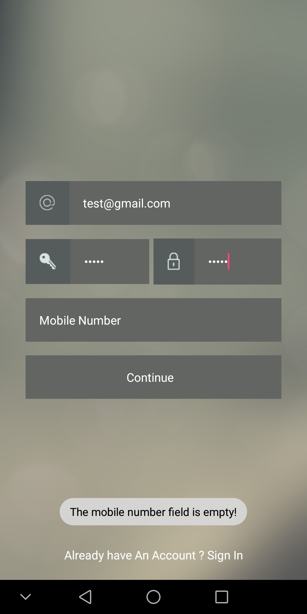
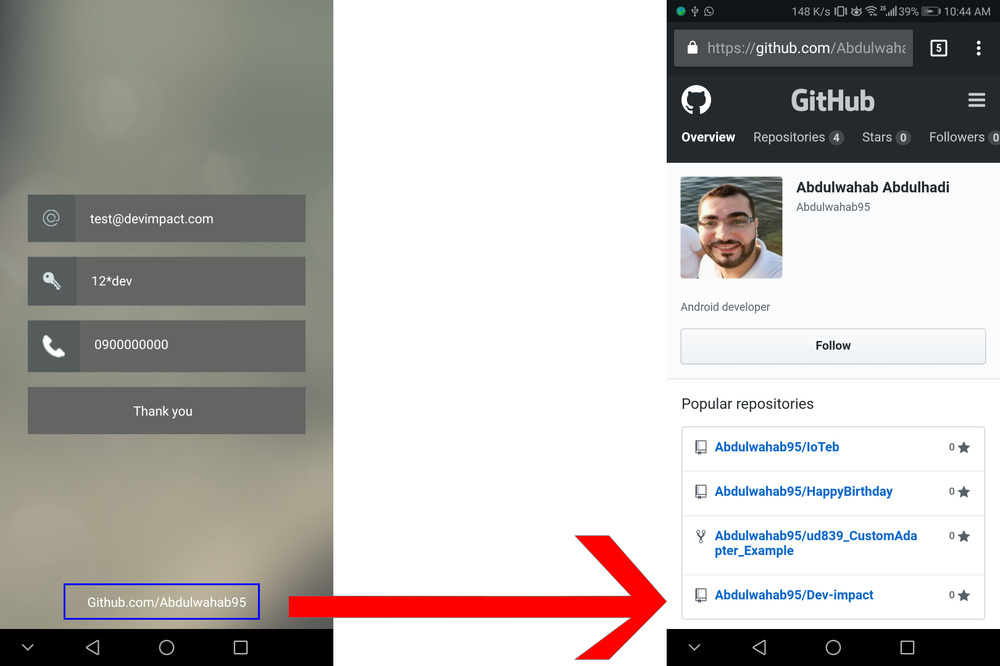

# Dev-impact

## ``` Screen shot Two activtites ```
Login Activity             |  Receiving data Activity
:-------------------------:|:-------------------------:
   |  


># ``` Validated```

```Check the Email ```            |  ```Check of password``` |  ```Check of agin pass ```
:-------------------------:|:-------------------------:|:-------------------------:
   |   |    

```Check of match pass``` |  ```Check mob not empty```
:-------------------------:|:-------------------------:
  |   
 
>> # Link
 

 ## Supervised by
> Slimane Salim 

 ## Follow Me:

[Linkedin](https://linkedin.com/in/abdulwahab-abdulhadi)

[Githup](https://github.com/Abdulwahab95)

[Facebook](https://facebook.com/AbdulwahabAbdulhadi95)
